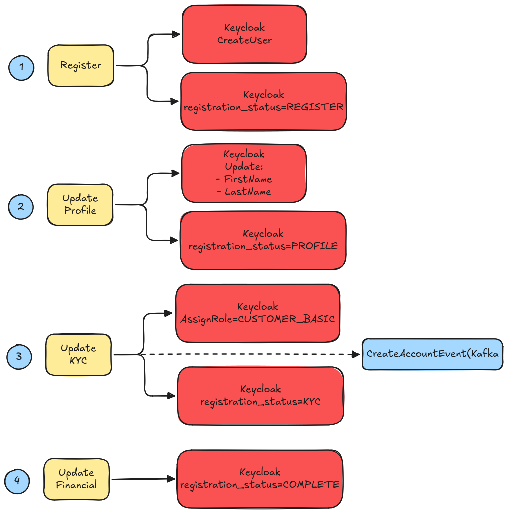

## Bank System
A microservices-based banking system built with Spring Boot and modern cloud-native technologies.
The project simulates core banking operations such as account management, transactions, and user onboarding.

It integrates authentication, API gateway, service discovery, and resilience patterns.


## Tech Stack
- Java
- Spring Boot
- Spring Cloud
- Postgres
- Flyway 
- Resilience4j
- Docker
- Keycloak
- Kong
- Kafka
- JUnit
- Testcontainers

## Running the Project
(**4.30 minutes**)Create the bank-maven-cache image, which contains the dependencies of all services:
```bash
docker build -f Dockerfile.maven-cache -t bank-maven-cache .
```
(**3.30 minutes**)Finally, run the docker-compose:
```bash
docker compose up --build
```

## Test the project
Check the files under folder `http`:
1. `user-service`: follow the register flow to get a `CUSTOMER_BASIC` role and perform request to valid endpoints.
2. `account-service`: endpoints only available if there is accounts via `CreateAccountEvent` from user-service.
3. `transaction-service`: an account needs to have balance to perform transactions(STATE: only works by manual SQL inserts).

## Features
### User Registration Flow
User registration is implemented using a custom Keycloak authentication flow composed of four steps:
1. Basic Info
2. Profile Info
3. KYC Info
4. Financial Info


### Transaction Types
The platform currently supports four types of financial transactions:
1. Transfer(STATE: Don't work)
2. Purchase(STATE: Don't work)
3. Service Payment(STATE: ACTIVE)
4. Withdrawal(STATE: Don't work)
