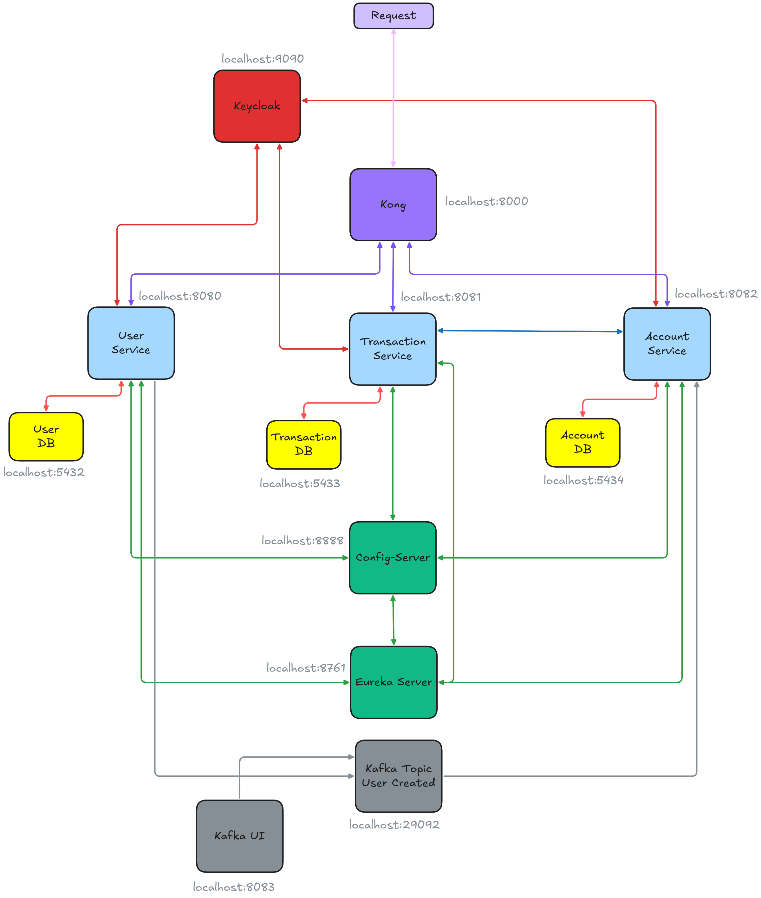

## Bank System
A microservices-based banking system built with Spring Boot and modern cloud-native technologies.
The project simulates core banking operations such as account management, transactions, and user onboarding.

It integrates authentication, API gateway, service discovery, and resilience patterns.



## Tech Stack
- Java 17
- Spring Boot 3.2.4
- Resilience4j
- Docker
- Keycloak 26.0.6
- Kong 3.6
- Apache Kafka 4.2.0
- JUnit 5
- Testcontainers

## Running the Project
Create the bank-maven-cache image, which contains the dependencies of all services:
```bash
docker build -f Dockerfile.maven-cache -t bank-maven-cache .
```
Finally, run the docker-compose:
```bash
docker compose up --build
```

## Architecture
The system follows a microservices architecture with the following infrastructure components:
- Service Discovery using ***Netflix Eureka***
- Centralized configuration using ***Spring Cloud Config***
- Authentication and authorization using ***Keycloak***
- API Gateway using ***Kong***
- Event streaming using ***Apache Kafka***

## Features
### User Registration Flow
User registration is implemented using a custom Keycloak authentication flow composed of four steps:
1. Basic Info
2. Profile Info
3. KYC Info
4. Financial Info

### Transaction Types
The platform currently supports four types of financial transactions:
1. Transfer
2. Purchase
3. Service Payment
4. Withdrawal
